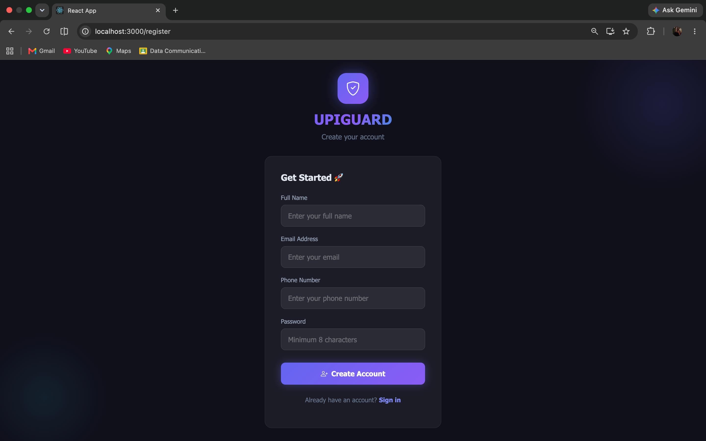
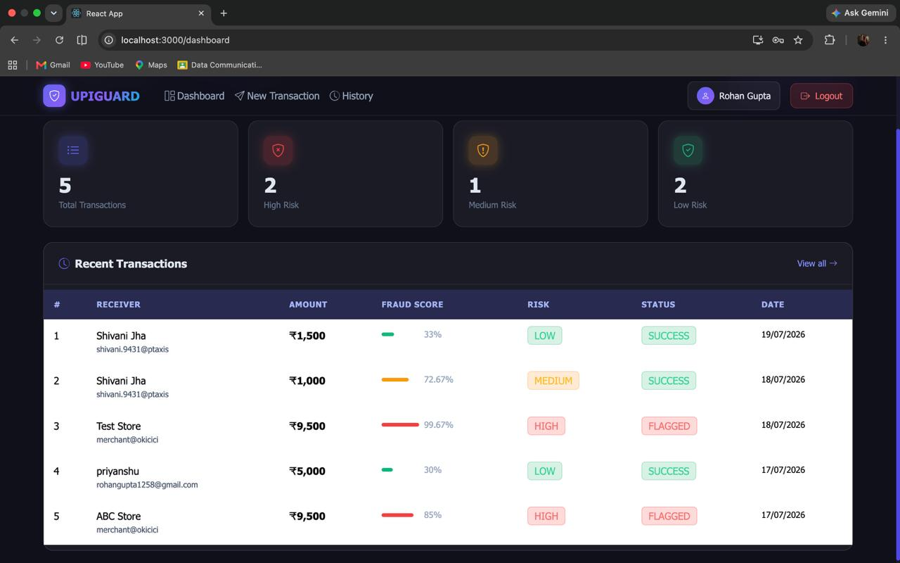
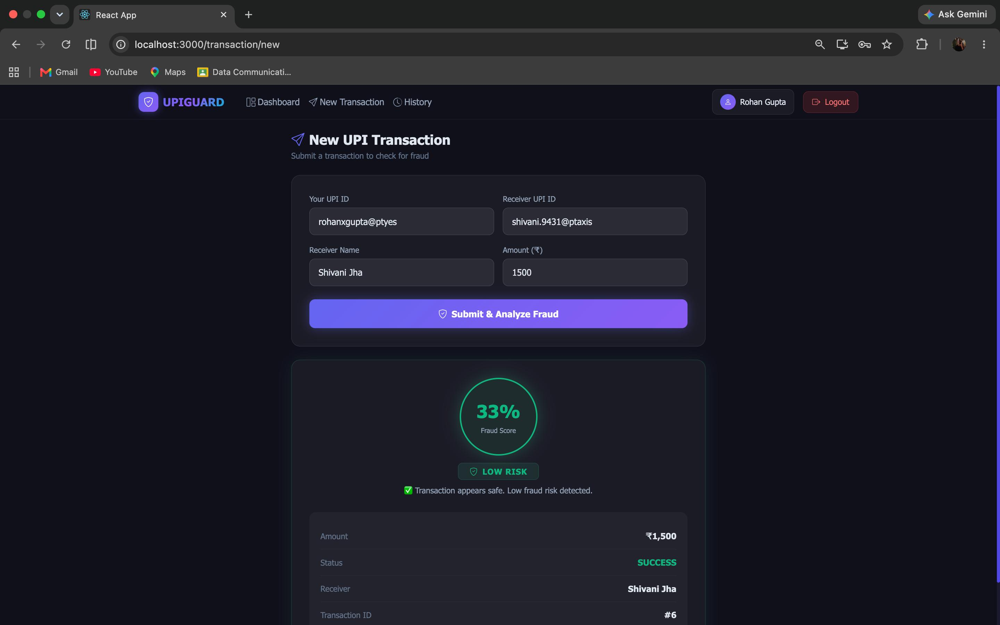
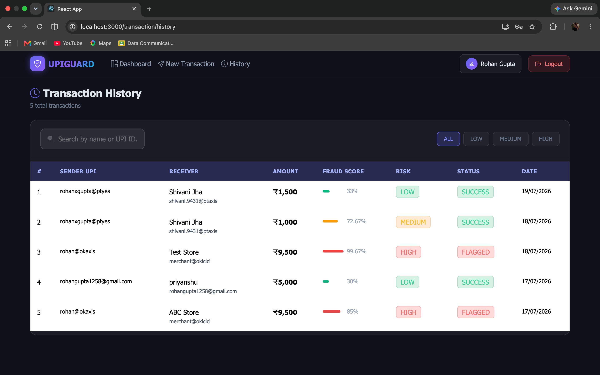

# 🛡️ UPIGUARD — Real-Time UPI Fraud Detection Using Machine Learning

UPIGUARD is a full-stack fraud detection system that analyses UPI transactions in **real time** and assigns a Fraud Probability Score (0–100%) before the transaction is finalised — flagging suspicious transfers as Low, Medium, or High risk.

Built as a Final Year Project (B.Tech CSE-IoT), designed with an industry-style microservice architecture rather than a single monolithic script.

---

## 🎯 Problem Statement

Most existing fraud detection systems flag fraud **after** money has already left the account. UPIGUARD analyses each transaction **before** it completes, giving users and admins immediate visibility into risk.

---

## 🏗️ Architecture

Three independently deployable microservices:
React Frontend (Port 3000)
              │
              ▼
Spring Boot Backend (Port 8080) ──JWT Auth + RBAC + MySQL
              │
              ▼
Python FastAPI ML Service (Port 8000) ──Random Forest Model
- **Frontend:** React.js + Bootstrap 5 — SPA with protected/admin routes
- **Backend:** Java Spring Boot + Spring Security (JWT) + Spring Data JPA
- **ML Service:** Python FastAPI serving a trained Random Forest model
- **Database:** MySQL with Hibernate/JPA

Each service can be developed, scaled, and deployed independently.

---

## 🤖 Machine Learning

- **Algorithm:** Random Forest Classifier (300 trees, max_depth=20)
- **Features:** 14 engineered features — transaction amount (log-normalised), time-of-day signals, weekend/night flags, same-bank vs cross-bank, and a composite `risk_score`
- **Performance:** 78.5% accuracy · 88.36% ROC-AUC · 90% fraud recall
- **Output:** `predict_proba()` gives a continuous fraud probability (0–100%) instead of a binary yes/no

---

## 🔐 Security

- JWT-based stateless authentication
- BCrypt password hashing
- Role-Based Access Control (USER / ADMIN)
- CORS configured for frontend-backend communication
- SQL injection prevention via Spring Data JPA (parameterised queries)

---

## 📸 Screenshots

**Register**


**Login**


**Dashboard**


**New Transaction — Real-Time Fraud Score**


**Transaction History**


---

## 🛠️ Tech Stack

| Layer | Technology |
|---|---|
| Frontend | React.js, Bootstrap 5, Axios, React Router |
| Backend | Java Spring Boot, Spring Security, Spring Data JPA |
| ML Service | Python, FastAPI, scikit-learn, joblib |
| Database | MySQL, Hibernate |
| Auth | JWT, BCrypt |

---

## 📂 Project Structure
upiguard/
├── frontend/ # React SPA
├── backend/ # Spring Boot REST API
├── upiguard-ml/ # Python FastAPI ML microservice
└── docs/screenshots/ # README assets

---

## 🚀 Getting Started

### 1. ML Service
```bash
cd upiguard-ml
pip install -r requirements.txt
uvicorn main:app --reload --port 8000
```

### 2. Backend
```bash
cd backend
cp src/main/resources/application.yaml.example src/main/resources/application.yaml
# edit application.yaml with your MySQL password + JWT secret
./mvnw spring-boot:run
```

### 3. Frontend
```bash
cd frontend
npm install
npm start
```

Visit `http://localhost:3000`

---

## 🔮 Future Improvements

- OTP verification for medium-risk transactions
- LSTM-based sequential fraud pattern detection
- NPCI sandbox integration for live UPI data
- Cloud deployment (AWS) with auto-scaling
- React Native mobile app with push alerts

---
